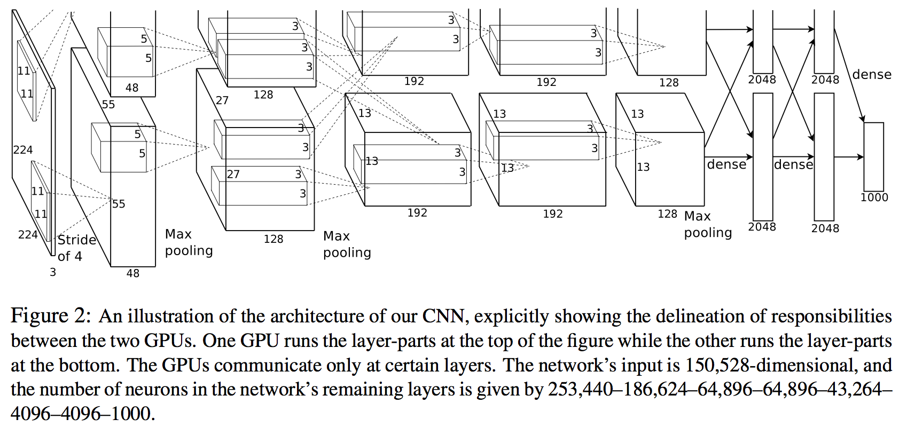

In 2012 Alex Krizhevsky et al. showed that Convolutional Neural Netowkrs (CNNs) could actually outperform traditional classical approaches to solve computer vision tasks such as object detection or object classification. Since then, the vast majority of the computer vision community has adopted this kind of methods. 

Related research has been mostly motivated by the annual ImageNet LSVRC contest, where different teams compete to achieve the highest accuracy with a given image dataset which contains more than 1,2 million images with 1000 categories.

In this regard, throughout the years several CNN architectures have been proposed, both introducing new and relevant approaches to solve the task of image classification. Moreover, these activity has lead to better understand some of the details of CNNs.

On the following, we summarize some of the most relevant work and their key ideas.

### ImageNet Classification with Deep Convolutinoal Neural Networks

*Krizhevsky, A., Sutskever, I., & Hinton, G. E. (2012). In Advances in neural information processing systems (pp. 1097-1105).* [[paper]](http://papers.nips.cc/paper/4824-imagenet-classification-with-deep-convolutional-neural-networks.pdf)

This paper was the one that first showed the power of CNNs on high-definition real-world images. They used a CNN architecture with 60 million parameters, consisting of five conv layers with max-pooling and three fully connected layers with a final softmax layer. **They achieved top-1 and top-5 error rates of 37.5% and 17% on LSVRC-2010, respectively.**

#### Motivation
- Efficient implementation of 2D convolution & powerful GPUs allow for large dataset training.
- Need of large learning capacity: CNNs provide this feature.
- CNNs contain fewer parameters and that were easier to train than traditional networks.

#### Network details

**Architecture**
- ReLu non-linearity: They used this activation for the first time and reported faster learning process.
- Brightness normalization: Lateral inhibition, creating competition for big activities amongs neuron outputs generated using different kernels.
- Pooling: Overlapping pooling of 3x3 pixel blocks with stride 2.
- 8 layers: 5 conv + 2 fully dense + ast layer contains 1000 units (with softmax).
- Optimization: Maimumuzation of multinomial logistic regression objective (= maximization of log-probability of the correct label under the prediction distribution).
- Data Augmentation: (1) Translations, horizontal reflections; (2) RGB-pixel-values alteration (PCA RGB decomposition).
- Dropout: Used with p=0.5 in the two fully dense layers. It roughly doubles number of iterations required for training to converge.

**Learning**
- SGD with batch size of 128, momentum 0.9, weight decay 0.0005
- Initial learning rate 0.01, divide by 10 when validation error rate stops decreasing.
- 90 cycles, 6 days, two NVIDIA GTX 580 3GB GPUs.
- Pamameter intialization: (1) Weights: Normal distirbution N(0, 0.01). (2)Bias: conv2, conv4, conv5, FD layers = 1, others = 0.

**Misc**
- They propose the system as a feature extractor model to enhance image retrieval.

#### Conclusion

- Deep learning for computer vision is a wise choice.
- Depth of the architecture matters.

